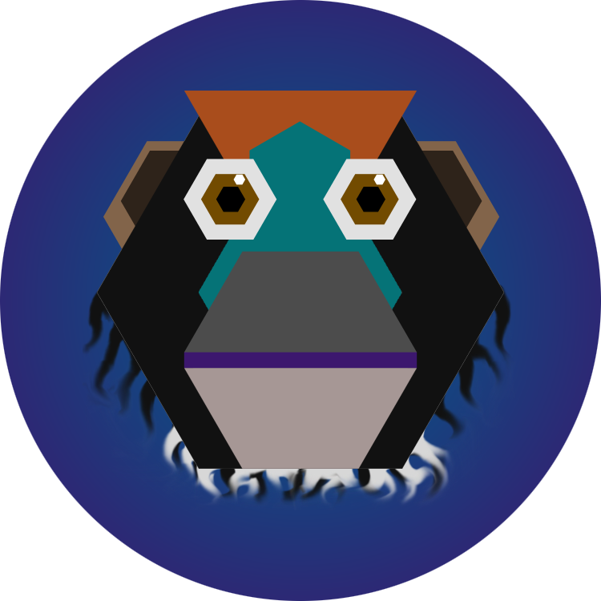

# Ape


Use your camera to capture real-world surfaces. Interact with your virtual world by applying the collection of captured surfaces to in-game objects and structures.  

## Setup the repository
1. Install libs. `cd` into the libs folder and run the setupLibs.* script suitable for your system.
2. This project uses a cmake build. `cd` back into the root project folder and perform a cmake build:
```
mkdir build
cd build
cmake ..
make -j4
```

## Credits
Ape. an augmented reality application by Patrick Seemann, Lars Pandikow and Moritz Willig.
